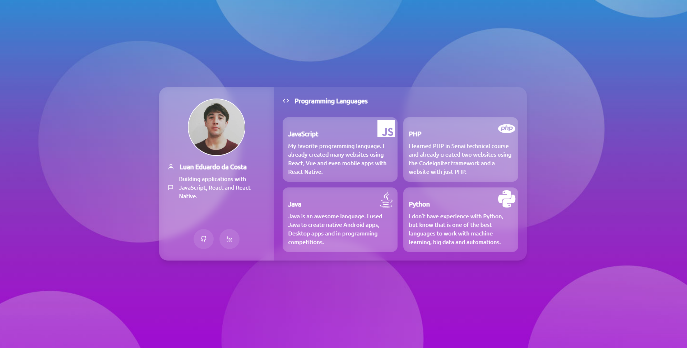

# :heart: React + Tailwind CSS + Glassmorphism

This project uses Tailwind CSS to design a glassmorphism based portfolio website.

:point_right: [CLICK HERE TO SEE IN YOUR BROWSER](https://luanedcosta.github.io/react-tailwindcss-glassmorphism/) :point_left:

## :astonished: What is Tailwind CSS And Glassmorphism?

- **Tailwind CSS**
  - Is a utility-first CSS framework packed with classes that can be composed to build any design, directly in the markup. [Click here to learn more](https://tailwindcss.com/).

- **Glassmorphism**
  - That's a UI trend that has been steadily growing in popularity over the last year. The general idea is to have a background-blur on an object, giving the impression of a frosted glass, but the premise of this style isn't new in itself. It has been used in Windows VISTA, iOS 7 and many other styles. [Click here to learn more](https://hype4.com/blog/glassmorphism).

## :link: Useful links to Learn

- https://hype4.com/blog/glassmorphism
- https://dribbble.com/tags/glassmorphism
- https://tailwindcss.com
- https://tailwindcss.com/docs/guides/create-react-app
- https://glassmorphism.com

## :man: Author

Luan Eduardo da Costa | [Follow me on Linkedin](https://www.linkedin.com/in/luaneducosta/)
